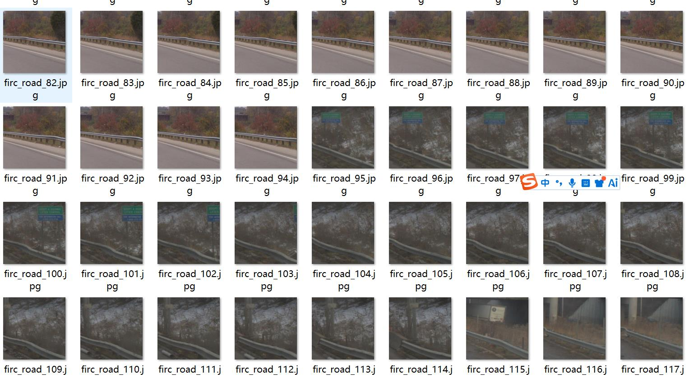
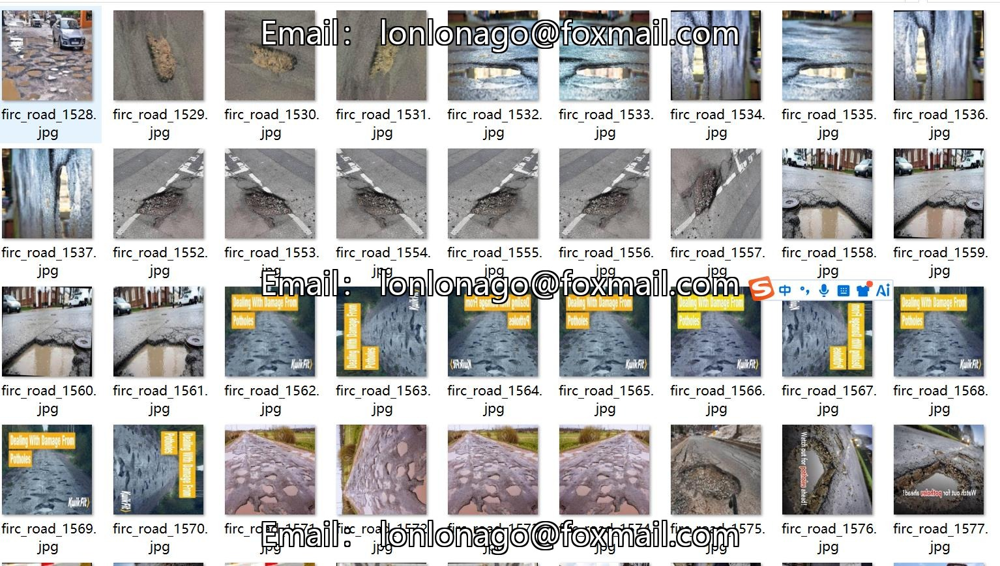
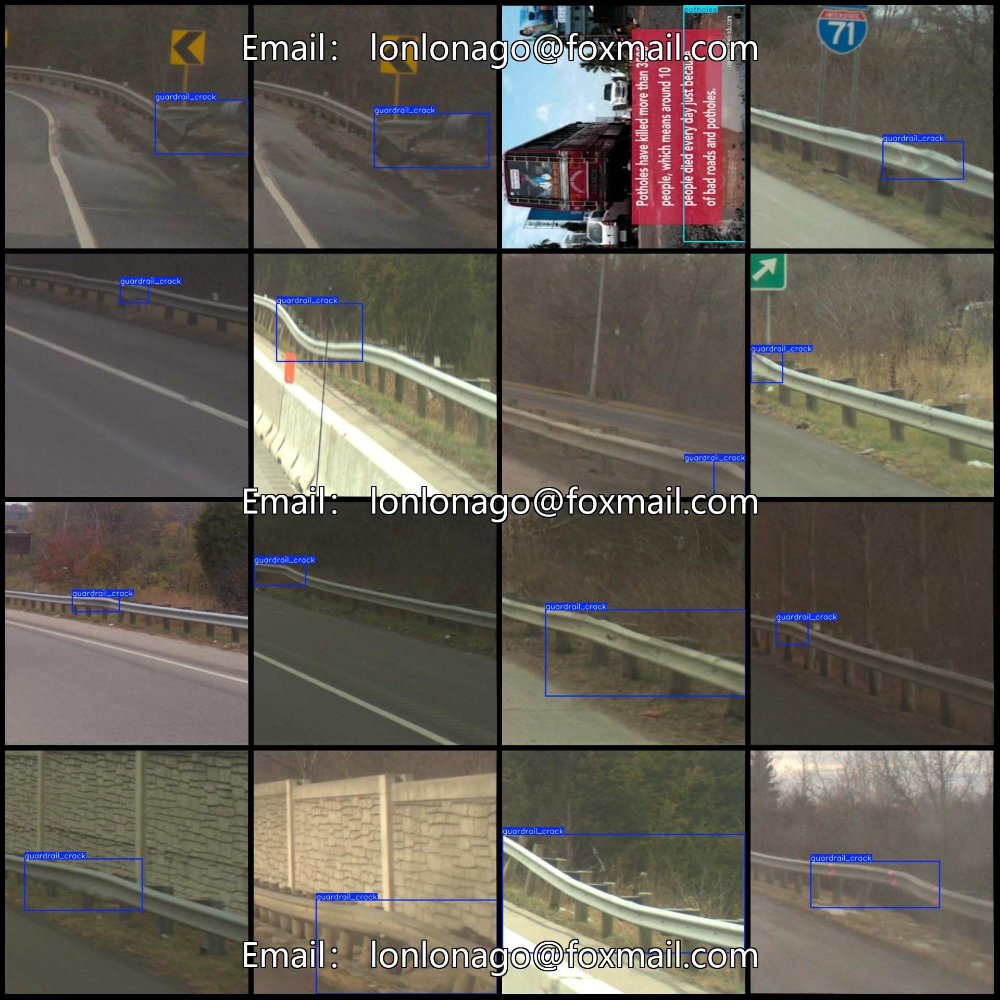
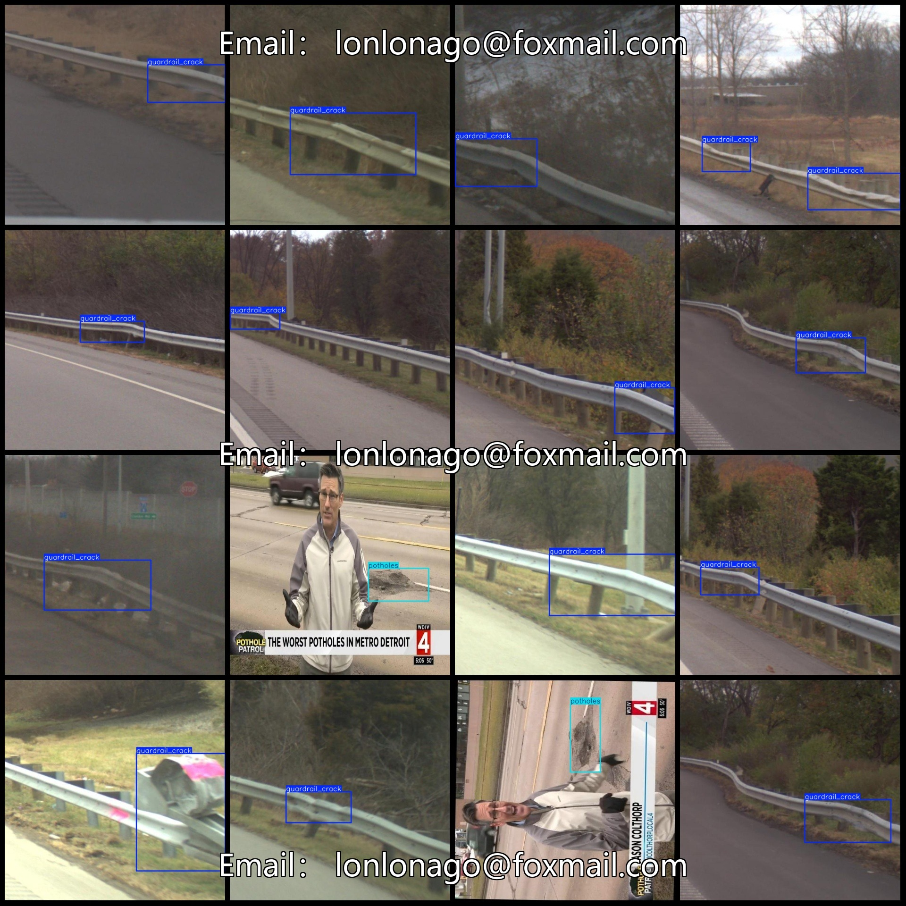

# Smart Traffic City Road Paving Cracks and Guardrail Deformation Detection Dataset (VOC+YOLO)

**Dataset Format:** Pascal VOC format + YOLO format (excluding the segmentation path in txt files, only containing jpg images along with their corresponding VOC format xml files and YOLO format txt 
files)

**Image Count (Number of JPG Files):** 1214
**Label Count (Number of XML Files):** 1214
**Label Count (Number of TXT Files):** 1214
**Label Count (Number of Categories):** 2
**Label Name for Categories (Note that the order of labels in the YOLO format does not match this, but refer to the "labels" folder's "classes.txt"):** ["guardrail_crack", "potholes"]

**Box Count per Category:**
- guardrail_crack (Defective guardrail) = 1023
- potholes (Puddles) = 454
**Total Boxes:** 1477

**Number of Images per Category:**
- guardrail_crack (Defective guardrail) = 999
- potholes (Puddles) = 215
**Image Resolution:** 640x640

**Annotation Tool:** labelImg
**Annotation Rules:** Draw boxes around categories

**Important Notice:** The dataset does not have a split into training validation test sets; you will need to manually divide it. Some images in the dataset are enhanced.

**Special Disclaimer:** This dataset does not guarantee any accuracy in the trained models or weight files.

**Image Preview:**

**Annotated Example:**

## Images

Here is a pay link on Stripe ( https://buy.stripe.com/3cs8yP7sY87d0vu9AB ). Please contact me lonlonago@foxmail.com after funding $89, and I will send you a complete data files , thank you!

